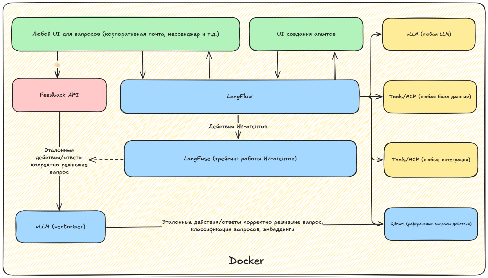

# Агентная система для обработки обращений в техподдержку

*красивая картинка-логотип сюда, или вообще презу уаткнуть*

## Информация по кейсу

- Кейсодатель: Росатом
- Кейсодержатель: TODO

## Разработчики
- [Алексей Ткаченко](https://github.com/da-the-dev/)
- [Вера Краснобаева](https://github.com/Vera-bahval)
- [Григорий Мацнев](https://github.com/pe51k)
- [Яков Марченков](https://github.com/RipYashok)

## Описание 
### Проблематика
Неизбежно в больших компаниях в возникает проблема разрозненности информационных сервисов. Информации становится все больше, искать нужно все сложнее. Компании содержать дорогие линии поддержки, но их сложно масштабиривать. Такой способ приводит к низкому качеству обработки запросов пользователей: по нашим подсчетам, в среднем в бигтехе **уходит в среднем 4 сообщения для решения 1 вопроса**.

### Последствия
- Долгое ожидание из-за пиков/нагрузки *(пики в ~11:00, после обеда и в конце рабочего дня)*
- Ошибочная маршрутизация между группами, из-за чего силы специалистов могут тратиться на задачи не из их экспертного поля
- Рутинные повторяющиеся операции, которые можно было бы автоматизировать
- Разрозненные знания, устаревшие/дублирующиеся статьи
- Слабая аналитика, не выявляются причины/не прогнозируются всплески

### Цель
TODO

### Решение
- Пользовательский опыт с нашим решением (UX future)
- Автоприём и классификация обращения
- Мгновенный поиск ответа и/или запуск типовых действий (сброс пароля, доступ)
- Прозрачный статус: «решено автоматически» или эскалация при низкой уверенности
- Ответ в удобном канале (почта/чат/портал), персонализация по роли/истории
- Система учится на кейсах, формирует отчёты и метрики качества

### Системный дизайн

  


## Аналитика

Мы проанализировали датасет с примерами обращений и выделили следующие ключевые темы

*Яш, распиши свою штуку тут*

### Разработанные агенты

*Вер, твоя часть тут*

## Как с этим работать
### Как запустить
Для начала сгенерируйте ключи, пароли и прочие секреты:
```bash
$ ./generate-creds.sh > .env
```

Теперь просто поднимаем все контейнеры:
```bash
$ docker compose up -d
```

### Как зайти
В Docker compose поднимаются ключевые сервисы на следующих портах:
- `:7860` - веб-интефейс Lang*flow*
- `:3000` - веб-интефейс Lang*fuse*

Интерфейс Lang*flow* не требует авторизации

Интерфейс Lang*fuse* требует авторизации. Посмотрите `.env` и найдите переменные ниже. По умолчанию создается учетная запись с этими данными:
```env
LANGFUSE_INIT_USER_EMAIL=langfuse-admin@rosatom.ru
LANGFUSE_INIT_USER_PASSWORD=<пароль>
```

### Описания файлов
| Файл                                                         | Описание                                                            |
| ------------------------------------------------------------ | ------------------------------------------------------------------- |
| [docker-compose.yaml](docker-compose.yaml)                   | Основной файл, который импортирует настройки для остальных сервисов |
| [langflow-docker-compose.yaml](langflow-docker-compose.yaml) | Описания сервисов Langflow                                          |
| [langfuse-docker-compose.yaml](langfuse-docker-compose.yaml) | Описания сервисов Langfuse                                          |
| [generate-creds.sh](generate-creds.sh)                       | Скрипт для генерации переменных окружения (пароли и секреты)        |
| [assets/](assets/)                                           | Папка с файлами для README.md и презентаций                         |